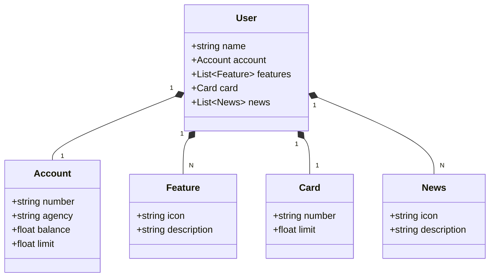

# Desafio DIO RESTful

## Diagrama de classes

```mermaid
classDiagram
    class User {
        +string name
        +Account account
        +List~Feature~ features
        +Card card
        +List~News~ news
    }

    class Account {
        +string number
        +string agency
        +float balance
        +float limit
    }

    class Feature {
        +string icon
        +string description
    }

    class Card {
        +string number
        +float limit
    }

    class News {
        +string icon
        +string description
    }

    User "1" *-- "1" Account
    User "1" *-- "N" Feature
    User "1" *-- "1"Card
    User "1" *-- "N" News
```
